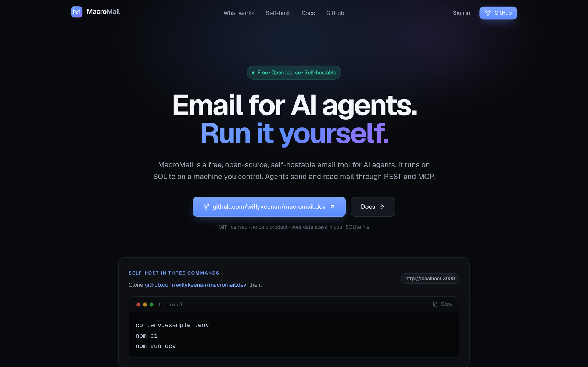

# MacroMail

A free, open-source, self-hostable email tool for AI agents.



<sub>Real screenshot of a self-hosted instance.</sub>

MacroMail is this Next.js app. Mail data lives in SQLite under
`MACROMAIL_DATA_DIR`. Agents talk to it over REST v1 and a hosted MCP
endpoint at `/api/mcp`.

Source: [github.com/willykeenan/macromail.dev](https://github.com/willykeenan/macromail.dev).
License: MIT.

## What works today

- Accounts and API keys
- Agent mailboxes on the server's own domains (`MACROMAIL_MAILBOX_DOMAINS`) with internal delivery between MacroMail mailboxes (no internet inbound)
- REST v1
- MCP at `/api/mcp` — the tools on that endpoint work
- Outbound email through the SMTP account each user saves in Settings (never the server owner’s mailbox)
- Optional read-only Gmail/Outlook connect when the server has OAuth env vars
- AI triage and drafts with the user’s own Anthropic key (Settings, or the `x-anthropic-key` header)

## Self-host (3 commands)

```bash
cp .env.example .env
npm ci
npm run dev
```

Open [http://localhost:3000](http://localhost:3000). Generate
`SESSION_SECRET` and `TOKEN_ENC_KEY` with `openssl rand -hex 32` before a
production start. More in [docs/SELF-HOST.md](docs/SELF-HOST.md).

```bash
npm run build
npm start
npm test
```

## Docs

Human docs: [/docs](https://macromail.dev/docs) once the app is running, or
the same route locally. Machine-readable: [`/llms.txt`](public/llms.txt) and
[`/llms-full.txt`](public/llms-full.txt).

## Run with Docker

The image is published at `ghcr.io/willykeenan/macromail.dev` for Apple silicon and Intel.

```bash
docker run -p 3000:3000 -v macromail-data:/data -e MACROMAIL_SESSION_SECRET=<long random string> ghcr.io/willykeenan/macromail.dev
```

Open http://localhost:3000. Agents connect over REST v1 or the MCP endpoint at `/api/mcp`.
